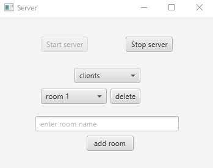
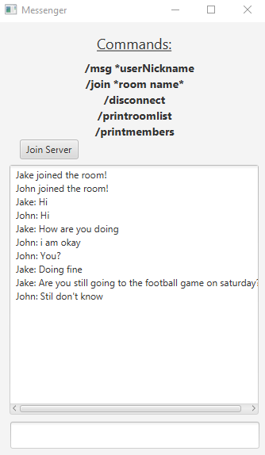
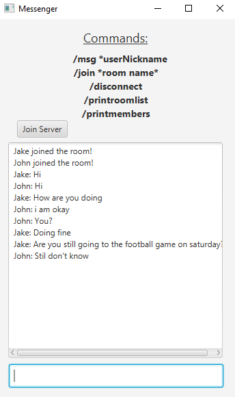

# About

Chat application using sockets

## Features
* group rooms and direct messages
* multiple users can join the server
* users can send messages simultaneously, because multi threading is implemented
* messages are saved to the .json file after stoping the server, BUT are not loaded back when starting the server again

## Technologies
#### Project is created with:

* Java 17.0.7
* Maven 3.9.3
* Javafx 19.0.2.1
	
## Setup
#### First:

* [download and install java JDK version 17 and set JAVA_HOME](https://docs.oracle.com/cd/E19182-01/821-0917/inst_jdk_javahome_t/index.html)
* clone or download the repo
* `cd ../chat` locate to project directory

#### To build .jar and run the .jar file:

* `mvnw clean package` builds server and client .jar files
* To launch the server, run shader jar in server/target folder
* To open a client app, run shader jar in client/target folder

>  **_IMPORTANT things to note:_**

* STOP THE SERVER BEFORE CLOSING AND DISCONNECT THE CLIENT BEFORE CLOSING, BECAUSE APPLICATIONS WILL BE RUNNING IN THE BACKGROUND

